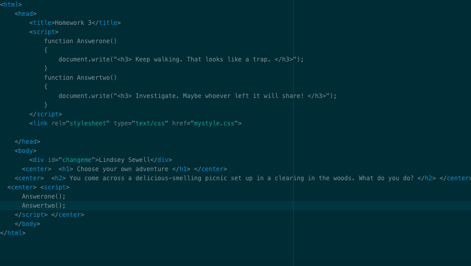

# Homework 3

This was another assignment that briefly sent me into a spiral of confusion. However, I found that I had not understood the prompt. I soon figured out that I did not need to create paths for the choices available; I just needed to access the DOM. That is much more doable. I enjoyed making a quick drawing for the picnic image for the first choice.

Here is a picture of my code:

# Homework 4

I probably should have copied my files into a homework 4 folder, but I didn't, and now we're here. I had a problem with some of the functionality of this project that put me into a cycle of searching for errors that turned out to be a case-sensitive problem.

a-c-g-k (end)
a-c-h (dead)
a-d (dead)
a-c-l (dead)
b-e (dead)
b-f-i (dead)
b-f-j-n (dead)
b-f-j-m-o (end)
b-f-j-m-p (end)
