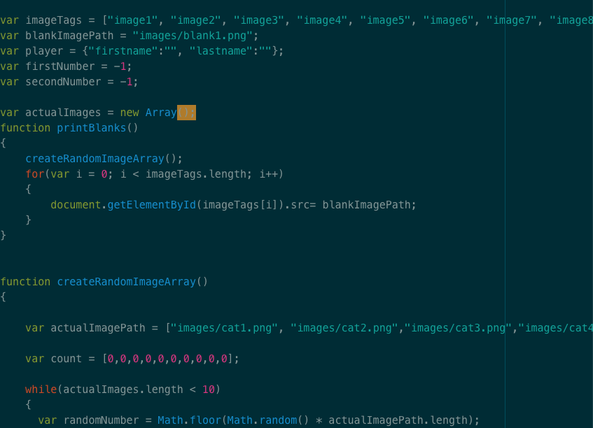

# Homework 5

I think this week's assignment went pretty well for me, even with a few issues. Hopefully the end result is correct due to my referencing Professor Cassens' example code. I started out trying to formulate arrays on my own, but I had some problems calling images into arrays. I would like to do more styling with this assignment when I have time. I look forward to next week's addition to the assignment.

# Homework 6

This week's assignment was the conclusion of homework 5. I think it went rather well, although I forgot that I could style tables in css, so I didn't have a funcitoning table for a while. I'm also not very good at the game, but I think my code is functioning.

Here is a screenshot of my code for my javascript file:

